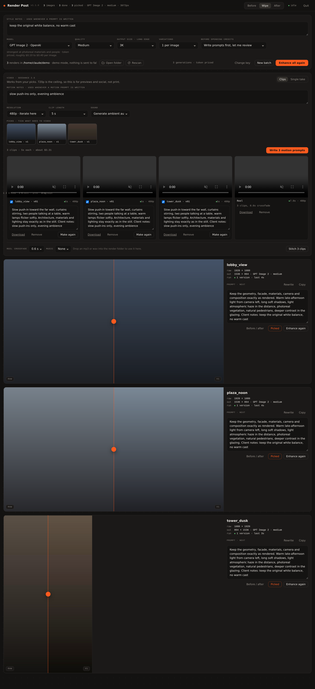
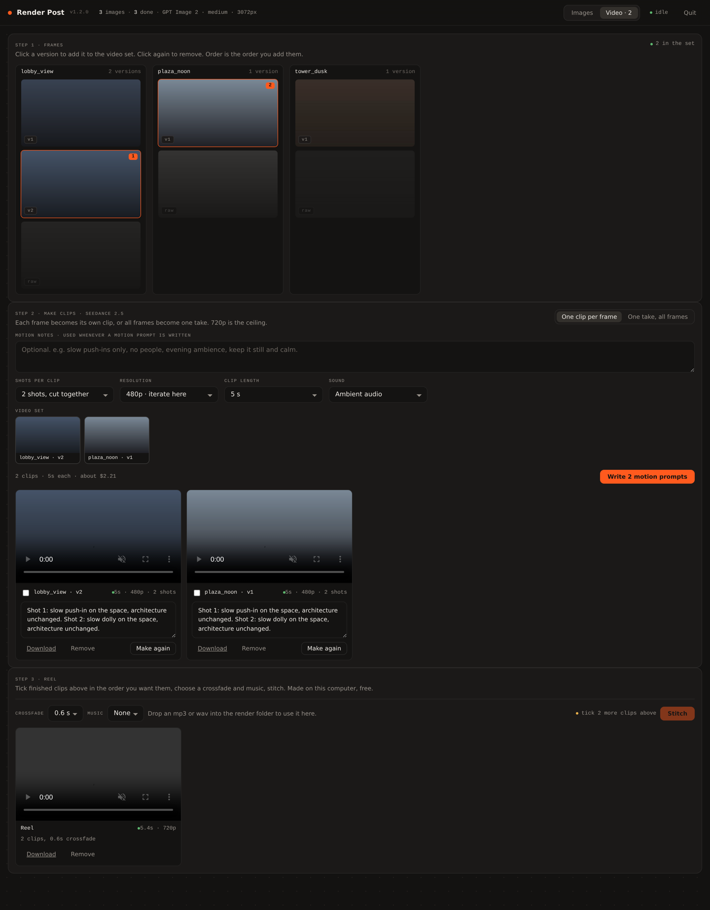

# Render Post

Post-production for architectural renders. Drop a folder of raw D5 output into Render Post and each image gets a reviewable AI enhancement pass: better light, believable materials, real-looking people and vegetation, a considered grade. From there: new camera **angles** of the same space, a consistent **character** across a set, and **video**: a clip per frame, a stitched reel with music, or a single take.

Runs entirely on your machine as one Windows exe. Bills only your own [fal.ai](https://fal.ai) account. Nothing is uploaded except the frame being processed and its prompt.



## Download

Grab `RenderPost.exe` from the [latest release](https://github.com/achristo714/RenderPost/releases/latest). Put it in a folder of renders and double-click, or double-click it anywhere and choose the folder. Windows shows "protected your PC" on first launch: **More info**, then **Run anyway**.

Full instructions with screenshots: [docs/RenderPost-Guide.pdf](docs/RenderPost-Guide.pdf).

## How it works

1. **Write prompts.** An art director model looks at each render and writes a bespoke enhancement prompt. Cents per image.
2. **Review.** Every prompt is editable. Style notes shape all of them.
3. **Enhance.** Pick a model (GPT Image 2, Nano Banana Pro, Nano Banana 2), press Enhance, or Enhance selected. Results are kept as versions; nothing is overwritten.
4. **Pick, compare, angle, animate.** Star your picks, save before/after sheets, generate other camera angles, and switch to Video to make clips (H3 Max, Kling 3.0, Seedance 2.5) and stitch reels.

Every spend shows an estimate first and confirms in-app. A running total sits in the header.



## Models

Built in: GPT Image 2, Nano Banana Pro, Nano Banana 2 for images; H3 Max, Kling 3.0 Pro, Seedance 2.5 for video. Extra models can be added without a rebuild through [`models.json`](models.json) in this repo, which the app reads on launch; the catalog dialog in the app documents the format.

## Building from source

Windows, Python 3.11+:

```
pip install pyinstaller fal-client pillow imageio-ffmpeg
build.bat
```

`dist\RenderPost.exe` is the whole product. Or merge to `main` in this repo: the GitHub Action builds the exe on every push to `main` and, when `APP_VERSION` is new, publishes a Release with the exe attached.

To run without building: `python RenderPost.py`. Add `--demo` to click around with fake results and no key.

## Project layout

Everything the app writes lives in `enhanced/` inside your render folder: versions (`name_v01.png`), angles (`name_a01.png`), `picks/`, `compare/`, `video/`, `trash/`, and the prompts. Your key and preferences live in `%APPDATA%\RenderPost`.

## Credits

Built by [Andy Christoforou](https://www.youtube.com/@andychristoforou) for ArchViz Academy students. Tested by Filip Filyov. UI follows the Ember Mono design system.
