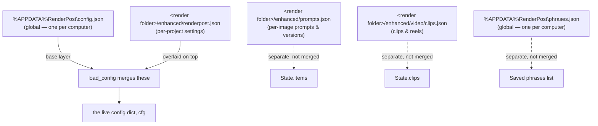
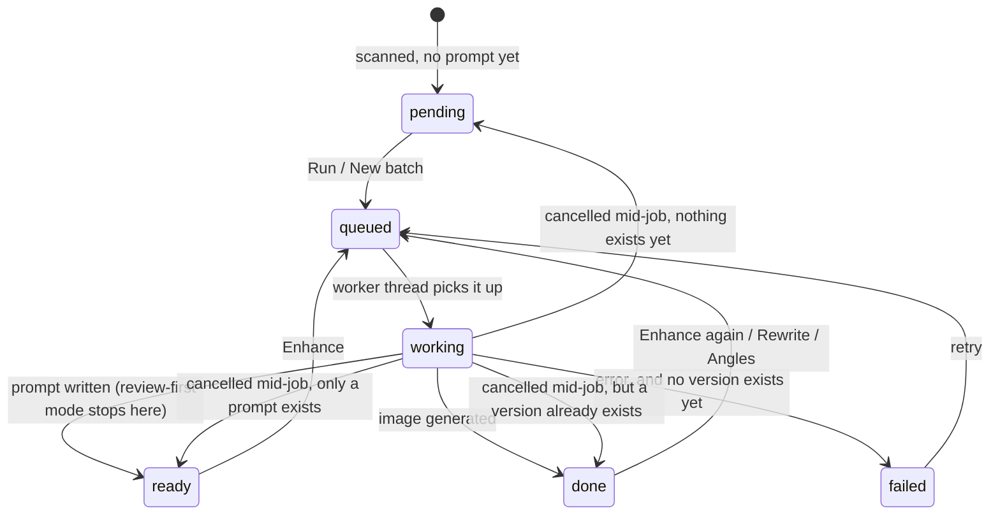
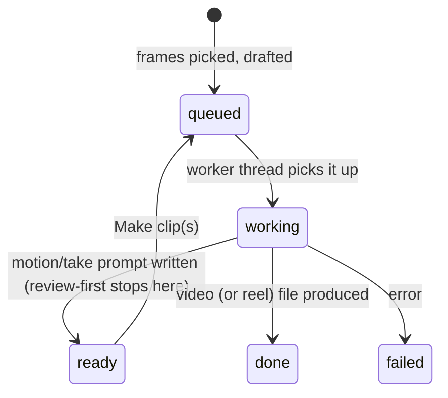
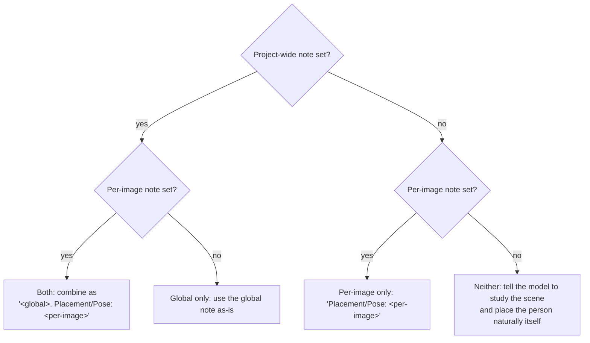

# Render Post — Behavior Map

> Last verified against: v1.9.0

This is a map of how Render Post actually behaves: what happens when you click something, where
that gets saved, and what logic decides the result. It is **not** a user guide (that's
[`RenderPost-Guide.pdf`](RenderPost-Guide.pdf) and the main `README.md`), and it is **not** a
full reference for every route or line of code. It exists so that anyone — Andy, Filip, a future
contributor, or an AI coding session — can understand an essential feature end-to-end before
changing it, without having to reconstruct the whole flow from scratch by reading `RenderPost.py`
top to bottom.

Read it like this: skim §1 and §2 once (the data model and the state machines are the foundation
everything else builds on), then jump straight to whichever feature section in §3 you're about to
touch.

## Contents

1. [Data model & persistence](#1-data-model--persistence)
2. [Item lifecycle & clip lifecycle](#2-item-lifecycle--clip-lifecycle)
3. [Feature behavior](#3-feature-behavior)
   - [3.1 Enhance pipeline](#31-enhance-pipeline)
   - [3.2 Angles](#32-angles)
   - [3.3 Character reference](#33-character-reference)
   - [3.4 Video: clips, takes, reels](#34-video-clips-takes-reels)
   - [3.5 Spend tracking & estimation](#35-spend-tracking--estimation)
   - [3.6 Folder management](#36-folder-management)
   - [3.7 Picks & Compare](#37-picks--compare)
   - [3.8 Model catalog & pricing](#38-model-catalog--pricing)
   - [3.9 Settings / config](#39-settings--config)
   - [3.10 Saved phrases](#310-saved-phrases)
4. [AI / prompt-brief reference](#4-ai--prompt-brief-reference)
5. [Demo mode approximations](#5-demo-mode-approximations)
6. [View / interaction map](#6-view--interaction-map)
7. [Known gaps / edge cases](#7-known-gaps--edge-cases)

---

## 1. Data model & persistence

Render Post has no database — everything lives in plain files, in five layers with different
scopes:

- **Global `%APPDATA%\RenderPost\config.json`** — your fal.ai key, model/quality/resolution
  preferences, recent folders list, the model-catalog URL override, and the spend-alert
  threshold. This is the same for every project you open.
- **Global `%APPDATA%\RenderPost\phrases.json`** — a flat list of saved phrases (`{id, text}`)
  shared by both the Style notes and Motion notes boxes, kept as its own sibling file rather than
  merged into `config.json`. Global like `config.json`, so the same phrase library is available
  across every project.
- **Per-folder `enhanced/renderpost.json`** — the handful of settings that are specific to *this*
  render folder: style notes, motion notes, the video frame set, the character note/description,
  the take-character toggle, and the running spend total for this project. `load_config()`
  layers this on top of the global file every time settings are read, so switching folders
  swaps out just these fields.
- **Per-folder `enhanced/prompts.json`** — not settings; this is the durable record of every
  image's draft prompt, the style notes it was written under, its full version history, and its
  character toggle/note. Written by `State.save_prompts()`, read back by `State.scan()` whenever
  a folder is opened or rescanned.
- **Per-folder `enhanced/video/clips.json`** — the durable record of every drafted/generated
  video clip and reel, independent of the image prompts above.

`enhanced/` folder layout, all inside the render folder:

| Path | What's there |
|---|---|
| `name_v01.png`, `name_v02.png`, … | ordinary enhancement versions, numbered per image |
| `name_a01.png`, `name_a02.png`, … | angle-variant stills (from §3.2), same numbering scheme, separate counter |
| `character.png` | the current project's character reference image (upload or AI-generated) |
| `picks/` | copies of versions you've starred, kept in sync automatically |
| `compare/` | before/after side-by-side JPGs, one per Compare click |
| `video/` | clip `.mp4` files, stitched `reel_NN.mp4` files, `clips.json`, `prompts-export.json` |
| `trash/` | versions you've deleted land here, not permanently erased |
| `prompts.json`, `renderpost.json` | described above |

A legacy single-file naming convention (`name_enhanced.png`) is auto-renamed to `name_v01.png`
the first time an old folder is rescanned, so nothing breaks for projects started on older
versions of the app.

## 2. Item lifecycle & clip lifecycle

Every image you drop into the folder is tracked as an **item**, with a status that drives what
the UI shows and what actions are available:

The key subtlety: a failed job never regresses an item that already has at least one successful
version — it stays `done` with the error message attached, so you never lose access to prior
results because a retry failed.

Video clips (and reels, and multi-frame "takes") go through a parallel but separate lifecycle,
tracked per clip rather than per image:

A clip's `kind` is one of `clip` (a single frame, animated), `take` (several frames toured in one
continuous shot via Seedance reference-to-video), or `reel` (a stitched compilation of finished
clips). If the app is closed while a clip is `queued`/`working`, it's reset to `ready` (if it has
a prompt) or `failed` (if not) the next time the folder is opened — nothing is left silently
stuck.

## 3. Feature behavior

Each section below follows the same shape: what you do → what request that sends → what the
backend does with it → what gets saved and where → what you see change.

### 3.1 Enhance pipeline

**Trigger:** "Write prompts" / "New batch" / "Enhance" buttons, or a per-image "Rewrite" /
"Enhance again."

**Route → backend:** `POST /api/run` (batch) or `POST /api/regenerate` (single image) both end up
calling `State.queue()`, which hands the job to `State._job()` on a shared worker pool (max 3
concurrent jobs of any kind — image, angle, clip, or reel). `_job()` uploads the raw image to
fal.ai (cached after the first time), then — unless an exact prompt was supplied — calls
`Fal.write_prompt()` to have a vision model write a bespoke enhancement prompt for that specific
image, folding in your style notes and (if the character toggle is on for that image) the
character brief. If "review prompts first" is on, the job stops there with status `ready` so you
can read/edit the prompt before spending anything on the actual image generation. Otherwise (or
once you press Enhance), `Fal.edit()` sends the prompt plus the image to whichever model you've
selected and downloads the result.

**Persisted:** the prompt and every generated version (file name, size, generation time, model,
timestamp, pick state, and whether a character was included) are saved to `prompts.json`.

**UI feedback:** the card's status dot and "step" text update on every poll (every 1.5s); a new
version appears as a new tab on the card once the job finishes.

### 3.2 Angles

**Trigger:** the "N angles" button on a finished version.

**Route → backend:** `POST /api/angles` runs `State._angles_job()`, which asks a vision model
(`Fal.write_angles()`) to propose N new camera positions for the *same* space shown in an
existing finished image — explicitly instructed to keep architecture, materials, and lighting
identical, only changing where the camera is. Each proposed angle prompt is then sent through
`Fal.edit()` individually, one new image per angle, saved incrementally (so a batch of 6 angles
that fails on the 4th still keeps the first 3).

**Persisted:** each angle becomes a new version on the same item, tagged `angle: true`, named
`name_a01.png`, `name_a02.png`, etc.

**UI feedback:** angle versions show up as new "a1", "a2"… tabs alongside the ordinary "v1",
"v2"… version tabs on the same card.

### 3.3 Character reference

Render Post supports one consistent character (person) per project, generated from a text
description or uploaded as a photo, then optionally included in individual images.

**Global character** — the "Character" panel (under "More"): Generate (text-to-image via
`Fal.generate_character()`, using a fixed studio-photo style prompt) or Upload save/replace
`enhanced/character.png`; Remove deletes it. This is one image per project, not per image.

**Per-image toggle** — each image card has its own "Character" checkbox, visible only once a
project character exists. Turning it on for a specific image reveals a placement/pose note field
for that image, and shows a one-time-per-session warning that Seedance video models refuse frames
with realistic people (relevant if that image is later used in a clip/take/reel). The checkbox
and its note are saved via `POST /api/item_config` straight into that image's entry in
`prompts.json` — this is per-image state, completely separate from the global character image
itself.

**Combining the notes** — when an enhance/angles job runs for an image with the character toggle
on, `character_guidance()` decides what placement instruction to actually send, based on whether
a project-wide note and/or a per-image note exist:

**Persisted:** the global character lives at `enhanced/character.png`; its text description at
`character_desc` in `renderpost.json`; the project-wide note at `character_note` in
`renderpost.json`; each image's own toggle/note in that image's `prompts.json` entry.

**UI feedback:** the character thumbnail in the setup panel; a "with character ·" note in a
version's tooltip and a "·" mark on its tab if that version was generated with the character
included.

### 3.4 Video: clips, takes, reels

Three steps, all under the Video tab:

1. **Pick frames** — click any raw image or generated version to add it to the video set (order
   matters for "takes").
2. **Make clips** — either "Separate videos" (one clip per picked frame, each animated
   independently — model, resolution, duration, shots-per-clip, and camera "energy" are all
   configurable) or "One video through all frames" (a single continuous take touring every
   picked frame in order, always via Seedance reference-to-video, marked experimental since the
   model recreates rather than reproduces the spaces). Motion prompts are written by
   `Fal.write_motion()`, then `Fal.video()` submits the actual generation job to whichever video
   model/endpoint applies (H3 Max/Turbo, Kling, or Seedance — each has a different argument shape
   and endpoint) and polls until it completes or is cancelled.
3. **Reel** — pick 2+ finished clips, an optional crossfade duration and music track, and Stitch
   combines them locally via ffmpeg (`State._stitch_job()`) into `video/reel_NN.mp4`. This step
   costs nothing extra since it doesn't call fal.ai.

**Persisted:** every clip/reel's metadata lives in `video/clips.json`; the actual video files sit
alongside it in `video/`.

**UI feedback:** each clip is its own card with a live status line, a `<video>` preview once
done, and (for finished clips) an "add to reel" checkbox that shows its position in the reel
order.

### 3.5 Spend tracking & estimation

Every image, angle, and video generation adds an estimated dollar amount to a running total shown
in the header, so costs are visible before you commit to a batch.

**How the estimate is computed:** for flat-priced models (the "nano" family), it's a fixed price
per image times a resolution multiplier. For token-priced GPT models, it's a lookup table by
quality tier and output size (the fal-published per-size pricing, approximated). Video cost is
per-second price (looked up by resolution, or by audio/silent for Kling) times duration.

**Persisted:** the running total lives in `renderpost.json`'s `spend` field, read-modified-and-
written by `State.add_spend()` every time a job finishes.

**A real bug, fixed in v1.8.5:** because up to 3 jobs can finish at nearly the same moment (the
worker pool runs up to 3 concurrently), three threads could each read the same `spend` value,
add their own image's cost, and write it back — with the last write winning and silently
discarding the other two additions. As of v1.8.5, both `add_spend()` and `save_config()` share a
single lock (`FOLDER_FILE_LOCK`) around their read-modify-write of `renderpost.json`, so
concurrent finishes no longer clobber each other. Totals from before the fix were not
retroactively corrected.

### 3.6 Folder management

Each render folder is an independent project — its own settings, prompts, and video set, none of
which follow you when you switch. "New project" opens a folder picker (recent folders are listed,
or Browse for a new one); "Rescan" picks up files added to the folder since it was opened, and
auto-enhances them immediately if "enhance straight away" mode is on; dragging image files onto
the window (or using the add-images flow) copies them straight into the folder.

### 3.7 Picks & Compare

Starring a version (the Pick button) copies it into `enhanced/picks/` and marks it in
`prompts.json`; unstarring removes the copy. The Picks tab is a filtered view showing only images
with at least one starred version, plus a flat grid of every picked version across the whole
project. "Before / after" (Compare) generates a single side-by-side JPG of the raw render next to
a chosen version, saved to `enhanced/compare/` — a static output, not part of the app's own
comparison slider (that's the interactive wipe view on every card).

### 3.8 Model catalog & pricing

The built-in image models (GPT Image 2.5 Flare/Sunburst, Nano Banana Pro/2) and video models (H3
Max/Turbo, Kling 3.0 Pro, Seedance 2.5) are defined directly in `RenderPost.py`, each with a fal
endpoint, a cost formula, and a `recommended` flag controlling whether it shows by default or
only behind "show all models." This built-in table can be extended or overridden, without
rebuilding the exe, by pointing the app at a hosted JSON file (`models.json` in this repo by
default, or any URL you set in Settings) — new or updated entries are merged over the built-ins
by key on every launch. If the remote fetch fails for any reason, the app silently falls back to
the built-in table only; it never crashes on a bad or unreachable catalog URL.

### 3.9 Settings / config

The fal.ai key is validated live (a cheap 2-byte test upload) before being saved, so a bad key is
caught immediately rather than surfacing later as a failed job. `--demo` mode swaps every fal.ai
call for a local fake (see §5) so the whole app can be exercised with no key and no cost. The app
checks GitHub for a newer release on launch and shows an "update available" link in the header if
one exists.

### 3.10 Saved phrases

**Trigger:** both the Style notes box (`#notes`, Images tab) and the Motion notes box (`#mnotes`,
Video tab) have their own "Add phrase"/"Saved phrases" controls and hint text, but share one
phrase library. Selecting text in either box and clicking "Add phrase" saves it; clicking "Saved
phrases," or pressing Shift+Tab while that box is focused, opens the saved-phrase list targeted at
that box; clicking a phrase in that list inserts it at the current cursor position in whichever
box opened the popup; the "×" next to a phrase deletes it (visible from either box, since the list
is shared).

**Route → backend:** `GET /api/phrases` lists saved phrases; `POST /api/phrases/add` appends a new
`{id, text}` entry (`id` is a `uuid4` hex string); `POST /api/phrases/delete` removes one by `id`.
All three sit ahead of the fal-key guard in `do_POST`/`do_GET`, since phrases never touch fal.ai.
The frontend tracks which textarea last opened the popup (`phraseTarget` in `app.js`) so "insert"
lands in the right box; there is no per-box split on the backend, it's a single flat list.

**Persisted:** a flat JSON array of `{id, text}` in the global `%APPDATA%\RenderPost\phrases.json`
(see §1), shared across every project and across both boxes — not per-folder like style/motion
notes themselves. Reads/writes are serialized under `PHRASES_FILE_LOCK` the same way
`renderpost.json` writes are serialized under `FOLDER_FILE_LOCK`.

**UI feedback:** a toast confirms a phrase was saved or an empty selection was rejected; the
saved-phrase popup re-renders immediately after an add or delete; inserting a phrase runs through
the same `input`-event pipeline as typing, so it triggers the normal autosave and prompt-length
recalculation.

## 4. AI / prompt-brief reference

All AI instructions ("briefs") live in `prompts.py` as plain text constants, assembled by
different `Fal` class methods and sent to a vision or image-generation model. None of this logic
lives inline in the request-handling code — wording changes always happen in `prompts.py`.

| Brief | What it instructs | Used by |
|---|---|---|
| `BASE_BRIEF` | Write an enhancement prompt for one render: keep geometry/materials/composition exactly as rendered, only improve lighting/materials/atmosphere/realism, stay true to the render's own color temperature | `Fal.write_prompt()` — every enhance job |
| `CHARACTER_BRIEF` | Include the reference person naturally in the scene, keeping their appearance consistent with the reference photo | `Fal.write_prompt()`, appended when an image's character toggle is on |
| `CHARACTER_T2I` | Generate a plain studio reference photo of a described person | `Fal.generate_character()` |
| `CHARACTER_AUTO_PLACEMENT` | Fallback instruction telling the model to decide placement itself | `character_guidance()`, when neither note is set (§3.3) |
| `CHARACTER_NOTE_BOTH` / `CHARACTER_NOTE_CARD_ONLY` | Templates combining the project-wide and per-image placement notes | `character_guidance()` (§3.3) |
| `ANGLES_BRIEF` | Propose N genuinely different, supportable camera angles of the same space | `Fal.write_angles()` |
| `MOTION_BRIEF` | Animate a single still: named camera move, ambient motion, one sound cue, architecture unchanged | `Fal.write_motion()`, single-frame clips |
| `MULTISHOT_BRIEF` | Write a numbered multi-shot sequence from one still (Seedance shot format) | `Fal.write_motion()`, when shots > 1 |
| `TAKE_BRIEF` | Write one continuous tour prompt referencing several ordered stills by `@Image N` | `Fal.write_motion()`, take mode |
| `TAKE_CHARACTER` / `MOTION_CHARACTER` | Keep the reference person's appearance consistent across a take/clip | `Fal.write_motion()`, when the character is included in video |
| `ENERGY` (calm / moderate / dynamic) | How bold the camera move should be | `Fal.write_motion()`, appended to every motion brief |

All prompt-writing calls (`write_prompt`, `write_angles`, `write_motion`) try a short list of
vision models in order (currently GPT-5.4, then Gemini 2.5 Flash) and fall back to the next one
if a model's response is empty or errors out.

## 5. Demo mode approximations

`--demo` (or the bundled exe's demo option) swaps every real fal.ai call for a local fake, so the
whole app works with no key and no cost. Most of the UI and file-handling logic is identical in
demo mode — but the *content* it produces is not a preview of real AI output:

- **Enhance**: instead of a real AI edit, demo applies a local contrast/color filter to the raw
  image. It looks different from the original, but it is not what the real model would produce.
- **Angles / motion prompts**: demo returns fixed, canned text (a hardcoded list of angle
  descriptions; templated motion sentences) rather than anything that actually looks at the
  image.
- **Character generation**: demo draws a simple procedural placeholder (a colored ellipse and
  rectangle), not a real photo.
- **Video**: demo doesn't generate a real clip; it waits briefly then reuses the source image.
- **Revising a prompt**: demo just swaps the trailing "client notes" text on the existing prompt,
  rather than actually reconsidering the prompt against the new notes.

The practical takeaway: demo mode is for exercising the UI and the app's own logic (routes,
persistence, state transitions), not for judging what a real enhancement, angle, or video will
look like — and a bug that only reproduces in demo mode should be checked against real mode
before assuming it affects real usage, and vice versa.

## 6. View / interaction map

The page has three views — **Images**, **Picks**, **Video** — switched by one function
(`setView()`) that toggles a single `data-view` attribute on the page body; CSS rules keyed off
that attribute show and hide whole regions rather than the JavaScript building different pages.
Within Images there's a second, independent toggle between a compact **Grid** view and the full
**Detail** (card) view.

Five modal dialogs cover: entering/changing your fal key, picking a project folder, editing the
model-catalog URL, a generic reusable "are you sure?" confirmation (used for anything destructive
or costly), and the one-time-per-session Seedance/character warning (§3.3).

The page polls the server for fresh state every 1.5 seconds, always. To keep that from disrupting
whatever you're doing — mid-typing a prompt, mid-drag on the comparison slider — every card
computes a small "signature" of just the fields that matter for its own display, and only
rebuilds its part of the page when that signature actually changes. This is why you can keep
typing in a prompt box while other cards elsewhere on the page update live in the background.

## 7. Known gaps / edge cases

A running list of behavior quirks that are understood but not yet fixed. Add to this list rather
than letting a known oddity go unrecorded — a one-line entry here is enough.

- **Character checkbox vs. Rewrite/Enhance race condition** (open, diagnosed 2026-09-13). Turning
  on a per-image character checkbox saves via its own request (`/api/item_config`), completely
  separate from the Rewrite/Enhance request. If both are clicked in quick succession — the
  natural way to use the feature — the enhance job can start and read the character flag before
  the checkbox's own save has finished, silently generating without the character. Confirmed by
  deliberately racing the two requests: character was dropped roughly 1 in 5 tries. Proposed fix:
  have the Rewrite/Enhance/Angles request carry the current checkbox state itself (read live from
  the page at click time) instead of depending on a separate request having already landed; this
  should also be applied to the batch "Enhance all" path, which has the same exposure. Not yet
  implemented.
- **Saved phrases are intentionally minimal** (by design, v1.9.0). No editing a saved phrase in
  place (delete and re-add instead), no reordering, no per-project phrase libraries (phrases are
  global across every folder, unlike style/motion notes), and no dedupe check — saving the same
  text twice creates two independently-deletable entries.
